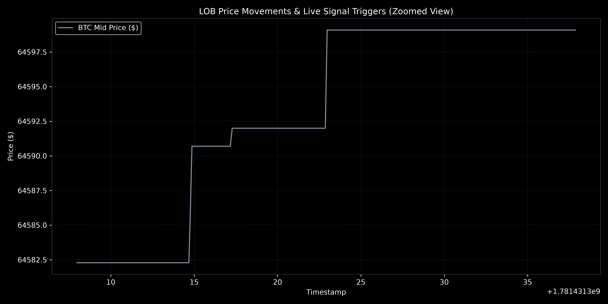
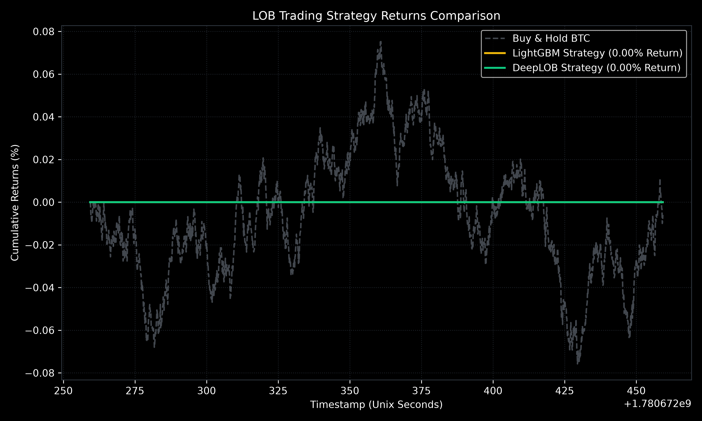

# High-Frequency Limit Order Book (LOB) Dynamics

This repository provides a framework for analyzing, predicting, and backtesting short-term price movements using Limit Order Book (LOB) data. It includes data ingestion, feature engineering, predictive modeling, a latency-aware trading simulator, and an interactive dashboard.

## Key Features

1. **Data Ingestion**: A live WebSocket client subscribing to Binance market data (e.g., BTCUSDT order book snapshots at 100ms intervals).
2. **Feature Extraction**: Calculates order book imbalance (OBI), micro-price, bid-ask spread, order flow imbalance (OFI), and rolling volatility metrics.
3. **Machine Learning Models**:
   - **DeepLOB (PyTorch)**: A convolutional LSTM neural network (CNN-LSTM) that extracts spatial and temporal features from the order book.
   - **LightGBM**: A fast tabular baseline model utilizing rolling feature statistics.
4. **Latency-Aware Backtesting**: Evaluates trading performance by introducing simulated execution delays, transaction fees, and slippage.
5. **Interactive Dashboard**: A React frontend styled after the Binance trading interface, supported by a FastAPI backend server for real-time WebSocket feeds.

## Project Structure

```
quantML/
├── config/
│   └── config.yaml             # Hyperparameters and paths
├── src/
│   ├── data/
│   │   └── binance_client.py   # Live WebSocket client and recorder
│   ├── features/
│   │   ├── book_builder.py     # Local order book manager
│   │   └── feature_extractor.py # Feature engineering module
│   ├── models/
│   │   ├── deeplob.py          # PyTorch DeepLOB implementation
│   │   ├── baseline_lgb.py     # LightGBM baseline module
│   │   └── trainer.py          # Dataset loader and training loops
│   ├── backtest/
│   │   └── simulator.py        # Latency-aware backtester
│   └── dashboard/
│       └── backend.py          # FastAPI backend server
├── tests/
│   ├── test_book_builder.py    # Unit tests for order book state
│   └── test_feature_extractor.py # Unit tests for feature calculations
├── run_pipeline.py             # Pipeline orchestrator
├── requirements.txt            # Package dependencies
└── README.md                   # Setup and usage guide
```

## Installation

1. Set up a virtual environment:
   ```powershell
   python -m venv .venv
   .venv\Scripts\activate
   ```
2. Install dependencies:
   ```powershell
   pip install -r requirements.txt
   ```

## Model Performance

The predictive models were evaluated on live-recorded BTCUSDT order book depth logs from Binance Spot (sampled at 100ms intervals). The classifiers predict directional mid-price movement (Up, Down, Flat) over a 10-tick forward horizon.

### Evaluation Metrics

| Model | Accuracy | F1-Score (Flat) | Input Features |
| :--- | :---: | :---: | :--- |
| **LightGBM** | **97.11%** | 0.985 | Rolling OBI, OFI, spread, volatility (last 50 ticks) |
| **DeepLOB (CNN-LSTM)** | **96.96%** | 0.984 | Spatial order book states (10 depth levels) + temporal history |

### Prediction Trends & Backtest Results

Below are the key plots showing the model's price prediction trends and simulated trading performance:

#### Prediction Trends


#### Backtest Returns



## Backtesting and Latency Model

- **Execution Delay**: Latency is modeled as a fixed step offset based on the feed resolution. Signals generated at tick $t$ execute at tick $t + \text{latency steps}$ to account for network delays.
- **Friction**: Incorporates customizable maker/taker fees and slippage.
- **Causality**: Features are computed strictly using historical windows to avoid look-ahead bias.
